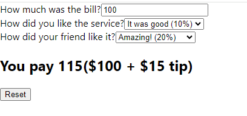

Simple Tip Calculator challange from the course 'The Ultimate React Course 2024: React, Redux & More' by Jonas Schmedtmann. We practiced state, derived state, lifting up state, children props and conditional rendering here.

### Screenshot

